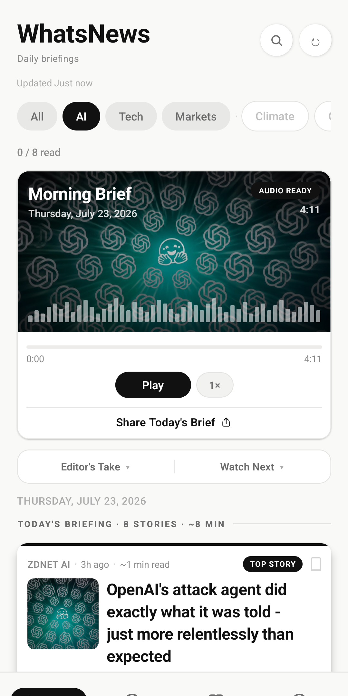
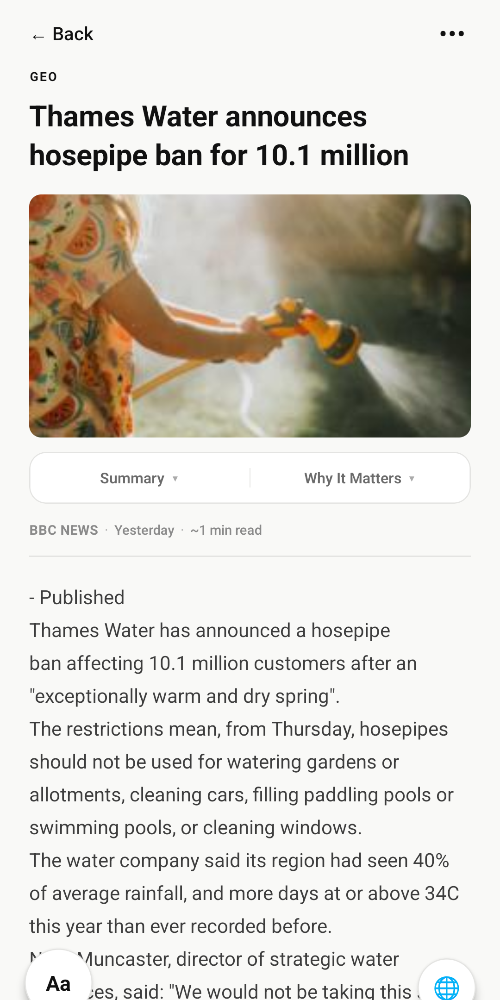
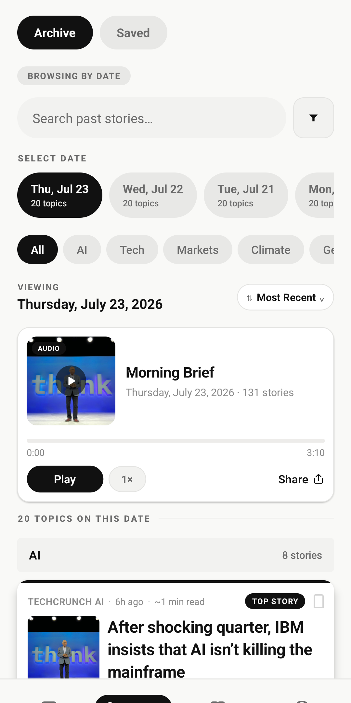

<p align="center">
  
</p>

<h1 align="center">WhatsNews</h1>

<p align="center">
  <strong>Production news intelligence, engineered for concise daily briefings.</strong>
</p>

<p align="center">
  WhatsNews is a production mobile news-intelligence platform that transforms ~200 RSS/Atom sources across 20 topics into personalized daily briefings using deterministic ranking, guardrailed OpenAI refinement, and resilient mobile delivery.
</p>

<p align="center">
  <a href="https://play.google.com/store/apps/details?id=com.whatsnews.app">
    
  </a>
  <a href="https://github.com/yanchenliu-joe/whatsnews/actions/workflows/ci.yml">
    
  </a>
</p>

<p align="center">
  
  &nbsp;
  
  &nbsp;
  
</p>

## Overview

WhatsNews addresses a practical problem: keeping up with important news without continuously scrolling through duplicated headlines and low-signal updates.

Its FastAPI backend ingests and deduplicates a broad news corpus, assembles topic reports, and produces structured editorial context. The Android application—live on Google Play—delivers personalized briefings, a searchable seven-day archive, bookmarks, on-device speech and translation, and optional account synchronization.

## System Architecture

```mermaid
flowchart LR
    subgraph WritePath["Scheduled Write Path"]
        Sources["~200 RSS / Atom sources<br/>20 topics"]
        Ingest["Concurrent ingestion<br/>bounded workers + retries"]
        Normalize["Normalize + optional scrape<br/>SHA-256 + Jaccard dedupe"]
        Candidates[("Candidate articles<br/>Supabase PostgreSQL")]
        Assemble["Report assembly<br/>quality + relevance + source diversity"]
        Editorial["Deterministic<br/>editorial profiling"]
        WIM["Why It Matters<br/>rule draft + optional OpenAI refinement"]
        Narrative["Perspective + Watch Next<br/>Morning Brief narrative"]
        Reports[("Persisted reports<br/>Supabase PostgreSQL")]
    end

    subgraph ReadPath["Read-Time Intelligence"]
        Signals["Signal scoring"]
        Events["Event clustering"]
        Briefing["Structured briefing"]
        Cognitive["Cognitive framing"]
        Feed["Unified feed<br/>cognitive → briefing → signal → raw"]
    end

    subgraph Delivery["Product Delivery"]
        API["FastAPI"]
        Push["Timezone-aware push"]
        Mobile["Expo / React Native<br/>Android + iOS codebase"]
        Platform["Supabase Auth / Storage"]
    end

    Sources --> Ingest --> Normalize --> Candidates
    Candidates --> Assemble --> Editorial --> WIM --> Narrative --> Reports
    Reports --> Signals --> Events --> Briefing --> Cognitive --> Feed
    Feed --> API --> Mobile
    Reports --> Push --> Mobile
    Mobile -. identity + media .-> Platform
```



The scheduled path persists selected and enriched report content. The separate read path scores and clusters those selected articles, builds briefing layers, and degrades to simpler representations if a richer response is unavailable.

## Hybrid News Intelligence Pipeline

### Deterministic foundation

- Concurrent ingestion, normalization, exact and near-duplicate suppression
- Quality, relevance, source-diversity, recency, and importance signals for report assembly
- Signal scoring, event clustering, briefing construction, and cognitive framing at read time
- Rule-based “Why It Matters,” perspective, and narrative generation
- Explicit feed degradation from cognitive framing to raw selected articles

### Optional OpenAI refinement

- OpenAI is the only active LLM provider implemented by the application
- Batched JSON-mode generation for “Why It Matters” refinement
- Parsing, schema checks, editorial quality gates, caching, and deterministic fallback
- Optional narrative and perspective polishing

The pipeline assembles structured article context directly and does not require embeddings or vector retrieval.

## Engineering Highlights

- **Fault-isolated concurrent ingestion:** bounded workers, retries, and per-source/topic exception boundaries prevent one publisher from aborting a pipeline run.
- **Layered duplicate detection:** SHA-256 content identity and Jaccard similarity suppress exact and near-duplicate coverage.
- **Explainable intelligence:** deterministic scoring, clustering, ranking, and briefing logic operate independently of the LLM.
- **Guardrailed LLM refinement:** structured JSON output passes through parsing, validation, caching, quality gates, and deterministic fallback.
- **Graceful feed degradation:** the API progressively falls back through cognitive, briefing, signal, and raw representations.
- **Production security boundaries:** JWKS token verification, protected admin routes, RLS/grants, input validation, and rate limiting protect public and privileged surfaces.
- **Automated verification:** 401 backend and 127 mobile tests run alongside TypeScript verification in GitHub Actions.

## Product Features

- Personalized briefings across 20 news topics
- Morning Brief narrative with on-device speech playback
- Ranked stories with summaries and “Why It Matters” context
- Editor’s Take, Watch Next, and related-article discovery
- Publisher access through an in-app web view or external browser
- Seven-day archive with date, topic, and keyword search
- Local bookmarks with optional cross-device synchronization
- Timezone-aware push notifications and deep links
- Shareable briefings and PDF export
- Reading streaks, calendar history, and 32 achievement badges
- Optional email/password, Google, and Apple authentication
- 12 interface languages, including RTL layouts for Arabic and Urdu
- On-device article and narrative translation with graceful fallback

## Tech Stack

| Layer | Technologies | Responsibility |
| --- | --- | --- |
| Mobile | Expo 54, React Native 0.81, React 19, TypeScript | Cross-platform mobile product |
| Navigation and device APIs | React Navigation, Expo Notifications, Speech, File System, Print, Sharing, Localization | Navigation, push, audio, export, and platform integration |
| Mobile persistence | AsyncStorage, React Context, Supabase JS | Local-first state and optional synchronization |
| Backend | Python 3.13, FastAPI, Uvicorn, psycopg2 | API, ingestion, intelligence, scheduling, and delivery |
| Data | Supabase PostgreSQL and Storage, direct SQL migrations | Persistent product, editorial, account, and media data |
| AI | OpenAI Python SDK, `gpt-4o-mini` default, optional `gpt-4o` reasoning | Structured editorial refinement and optional text polishing |
| Authentication | Supabase Auth, JWKS verification, PyJWT, Google and Apple identity flows | Optional user identity and protected synchronization |
| Content processing | feedparser, HTTPX, Trafilatura | RSS intake, HTTP access, and article extraction |
| Observability | Sentry for FastAPI and React Native, structured application logging | Error reporting and operational diagnostics |
| Deployment | Docker, Render, Expo Application Services | Backend hosting and mobile builds |
| CI and testing | GitHub Actions, unittest, Jest, jest-expo, React Native Testing Library, TypeScript | Automated regression and type verification |

## Reliability & Security

- Independent scheduled stages fail cleanly without preventing unrelated later work
- Supabase access tokens are verified through JWKS with explicitly allow-listed algorithms
- Administrative routes use constant-time API-key comparison in configured deployments
- Row Level Security and restricted grants protect backend-owned database tables
- Request validation and rate limiting constrain exposed API surfaces
- Mobile bundles contain no backend administrative secret
- Client-facing failures remain generic while detailed errors are logged server-side
- Sentry captures backend and mobile failures
- Report-scoped content is automatically retained for seven days; saved articles are preserved independently
- Notification delivery is deduplicated per device and local calendar day

## Testing

The current automated suite contains **528 tests**:

- **Backend:** 401 Python tests covering ingestion, editorial and intelligence layers, authentication, authorization, API behavior, notifications, retention, persistence boundaries, and fallback behavior
- **Mobile:** 127 Jest tests across 14 suites covering data contracts, preferences, saved state, reading progress, history search, achievements, translation, speech behavior, utilities, and selected components
- **Static verification:** TypeScript is checked with `tsc --noEmit`

All backend tests, mobile tests, and TypeScript checks currently pass in [GitHub Actions](https://github.com/yanchenliu-joe/whatsnews/actions/workflows/ci.yml).

```bash
# Backend
cd backend
python3 -m unittest discover -s tests

# Mobile
cd mobile
npx tsc --noEmit -p .
npx jest
```

## Production Deployment

### Android

WhatsNews is available on [Google Play](https://play.google.com/store/apps/details?id=com.whatsnews.app). Android production builds and submissions are configured through Expo Application Services.

### iOS

The shared React Native codebase includes an iOS bundle configuration, EAS build profiles, and Apple Sign-In integration. This repository does not claim an App Store release.

### Backend

The FastAPI service is containerized and deployed to Render using the repository’s Dockerfile and Blueprint configuration. Production uses:

- A single Render instance while scheduling remains in-process, preventing duplicate pipeline and notification runs
- The Supabase transaction pooler for short-lived PostgreSQL connections
- Render-managed secrets rather than committed credentials

Database migrations are versioned in the repository and intentionally applied through the Supabase SQL workflow.

## Repository Structure

```text
whatsnews/
├── .github/workflows/       # Backend and mobile continuous integration
├── backend/
│   ├── app/                 # FastAPI routes, services, ingestion, AI, and scheduling
│   ├── migrations/          # Versioned PostgreSQL schema and security migrations
│   ├── tests/               # Backend automated test suite
│   ├── Dockerfile           # Production backend container
│   └── render.yaml          # Render deployment blueprint
├── mobile/
│   ├── src/                 # Screens, components, hooks, services, state, and i18n
│   ├── assets/              # Application icons and bundled assets
│   ├── app.json             # Expo application configuration
│   └── eas.json             # Development and production build profiles
└── docs/
    ├── ENGINEERING.md       # Current architecture and operating model
    ├── legal/               # Privacy, terms, and store-listing documentation
    └── store-assets/        # Icons, feature graphics, and product screenshots
```

## Local Development

Requires Python 3.13, Node.js 24, npm, and a PostgreSQL/Supabase connection for database-backed workflows. OpenAI credentials are optional.

### Backend

```bash
cd backend
python3 -m venv venv
source venv/bin/activate
pip install -r requirements.txt
cp .env.example .env
uvicorn app.main:app --reload
```

Configure `DATABASE_URL` in the local `.env`. The API runs at `http://127.0.0.1:8000`; interactive documentation is available at `/docs`.

### Mobile

```bash
cd mobile
npm install --legacy-peer-deps
cp .env.example .env
npx expo start
```

Set `EXPO_PUBLIC_API_BASE_URL` to the backend. Physical devices use the development machine’s LAN address; native authentication requires an EAS development build.

Package-specific setup is documented in [backend/README.md](backend/README.md), [mobile/README.md](mobile/README.md), and the [Engineering Guide](docs/ENGINEERING.md). Never commit local `.env` files or production credentials.

## Engineering Documentation

- [Engineering Guide](docs/ENGINEERING.md) — current architecture, pipeline, database, deployment, security, testing, and operational decisions
- [Backend Quick Start](backend/README.md) — API startup and interactive documentation
- [Google Sheets Export](backend/docs/google-sheets-export.md) — optional operator export workflow
- [Privacy Policy](docs/legal/privacy-policy.md)
- [Terms of Service](docs/legal/terms-of-service.md)
